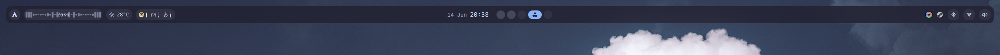

# Quickshell Bar



A simple, themeable bar built with [QML](https://doc.qt.io/qt-6/qtqml-documents-topic.html)/[Quickshell](https://quickshell.org/) for Hyprland and Niri. Runs horizontally (top/bottom) or vertically (left/right).

## Features

- Hyprland and Niri workspaces
- Clock
- System tray
- Network and Bluetooth status
- Audio volume
- Media player with cover popup and CAVA visualizer
- Weather from Open-Meteo
- CPU, memory and temperature monitor
- Notifications
- Multiple built-in themes

## Requirements

- `quickshell`
- `hyprland` or `niri`
- `cava` — audio visualizer
- `lm_sensors` — CPU temperature
- `curl` — weather
- A Nerd Font (e.g. `Maple Mono NF`)

## Getting started

Clone the repo into your quickshell config:

```sh
git clone https://github.com/nino-mau/quickshell-bar.git ~/.config/quickshell/bar
```

Run it with:

```sh
qs -c bar
```

## Configuration

Edit `Commons/Config.qml`:

- `position` — `"horizontal"` (top) or `"vertical"` (left)
- `edge` — optional override of the screen edge (`"top"`/`"bottom"`/`"left"`/`"right"`)
- `theme` — `"catppuccin"`, `"rose-pine"`, `"tokyo-night"` or `"anime"`

Themes live in `themes.json`; add your own by copying an existing entry and
setting its `theme` name. The bar reloads automatically on save.
